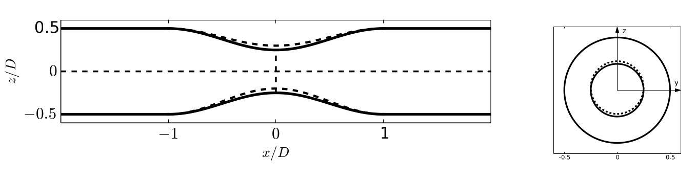

title: Advection--anisotropic diffustion--reaction in a stenosis channel

# Advection--anisotropic diffustion--reaction in a stenosis channel # {#eg_aadr_stenosis}

The stenosis geometry is defined by a smooth constriction profile.

In this study, the transport of thrombogenic factors is modeled using an AADR equation, coupled with the Navier--Stokes equations for blood flow. The governing equations are written as:

$$
\nabla \cdot \mathbf{u} = 0, \\
\rho_0 \partial_t \mathbf{u} + \rho_0 (\mathbf{u}\cdot\nabla)\mathbf{u} = -\nabla p + \mu \nabla^2 \mathbf{u}, \\
\frac{\partial C}{\partial t} + \mathbf{u}\cdot\nabla C = \nabla \cdot (\mathbf{D}\nabla C) - h_2' C
$$

where $C$ is the normalized concentration of thrombogenic factors, $\mathbf{u}$ is the velocity field, $\mathbf{D}$ is the anisotropic diffusion tensor, and $h_2'$ is the effective decay rate. The diffusion tensor of thrombogenic factors is expected to be anisotropic, with $D_{xx} > D_{yy} \approx D_{zz}$.

A steady parabolic flow profile can be first obtained using the standalone Musubi fluid solver, with a mean inlet velocity of $u_x = 6.69\,\mathrm{mm/s}$, corresponding to a Reynolds number of 5. The maximum local Reynolds number in the stenotic throat is approximately 40. No-slip boundary conditions are applied on all channel walls using the bounce-back scheme, while the outlet adopts a zero-gauge pressure condition using the anti-bounce-back approach. The lattice resolution is $dx = 7.8125\times10^{-3}\mathrm{mm}$, corresponding to $mesh_level = 2$ in `musubi_fluid_no_interaction`. The physical parameters are set as $\mu = 1.5\times10^{-6}\,\mathrm{kg/(mm\cdot s)}$ and $\rho_0 = 1.121\times10^{-6}\,\mathrm{kg/mm^3}$ giving a time step $dt = 4.56\times10^{-6}\,\mathrm{s}$. The relaxation parameter is set to $-1/\omega = 0.8$, leading to a lattice velocity of $4\times10^{-3}$ at the inlet. The axial velocity component $u_x$ and the radial velocity $u_r$ in the steady result is shown in [$u_x$](./reference/stenosis_vel_u_crop.png) and [$u_r$](./reference/stenosis_vel_v_crop.png) respectively.

The result from the standalone Musubi fluid solver is then coupled with the Musubi passive-scalar solver setup in `musubi_ps.lua` for solving the AADR equation. To represent the inflammatory activity in the stenotic region, the local wall concentration is prescribed to increase linearly in time until reaching saturation:

$$
  C_w(t) = \min(C_0 + k t, 1),  
$$

where $C_0=0$ is the initial concentration, and $k = 4.67\times10^{-2}\,\mathrm{s^{-1}}$ corresponds to a timescale of five convective passes through the channel. The non-stenotic vessel walls are treated as impermeable using the bounce-back boundary condition, ensuring zero normal flux of the scalar. Open boundary conditions are applied at both inlet and outlet.

The anisotropic diffusion tensor is defined as:

$$
\mathbf{D} =
\begin{pmatrix}
D_{xx} & 0 & 0 \\
0 & \alpha D & 0 \\
0 & 0 & \alpha D
\end{pmatrix},
$$

where $D_{xx} = D$ is the axial diffusion coefficient and $\alpha$ ($0 < \alpha \leq 1$) controls the degree of anisotropy. The reference diffusion coefficient is $D = 1.34\,\mathrm{mm^2/s}$, corresponding to a lattice relaxation time of 0.8~\cite{Mezali2023a}. The reaction rate is modeled as $h_2' = \lambda h_2$, where $h_2 = 2.3\,\mathrm{s^{-1}}$ is the thrombin decay rate from~\cite{Leiderman2011a}. Varying $\lambda$ allows analysis of how reaction kinetics influence thrombus shape and concentration profiles.

Three diffusion anisotropy ratios ($\alpha = 0.1, 0.5, 1.0$) and three reaction rate coefficients ($\lambda = 20, 100, 500$) are tested to explore the interplay between diffusion anisotropy and reaction strength. The scalar field evolution is simulated using the Musubi passive-scalar solver for 22,000 time steps, coupled to the steady flow field obtained from the Musubi fluid solver. The results are shown in `reference`, with the naming pattern $tracking\_Re\_\alpha\_\lambda$.

To extend the current one-way coupling to a two-way coupling framework, the file `musubi\_fluid.lua` is provided. In this configuration, a Brinkman term is introduced to account for the blockage effects induced by thrombus formation. This feature remains experimental, and its numerical behavior is still under investigation.
