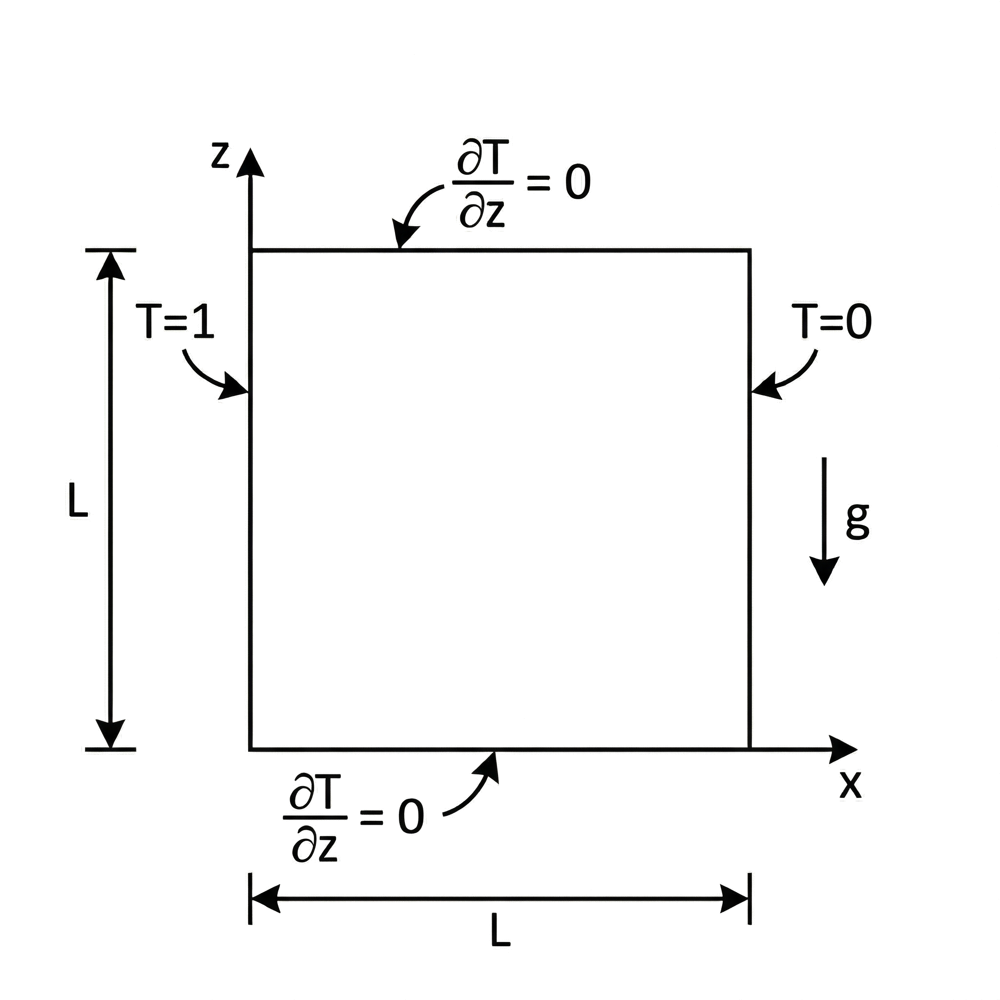
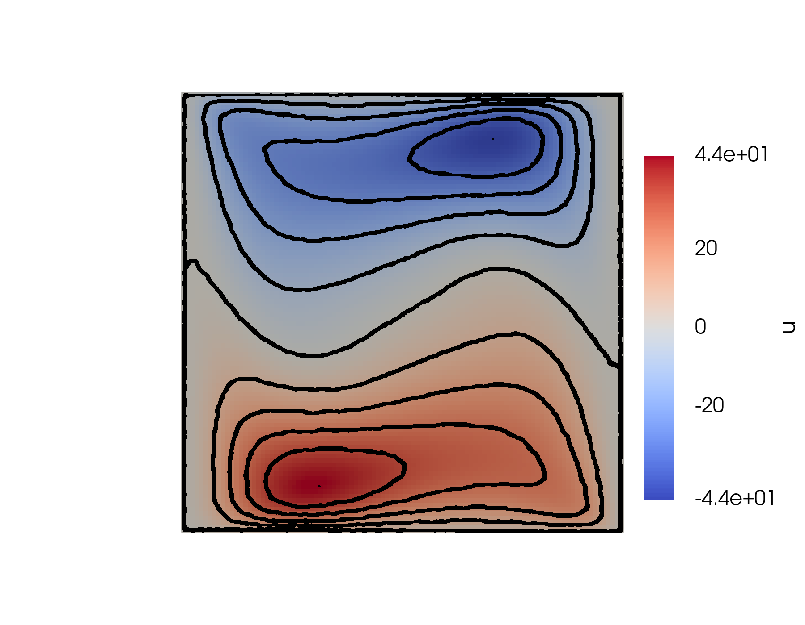
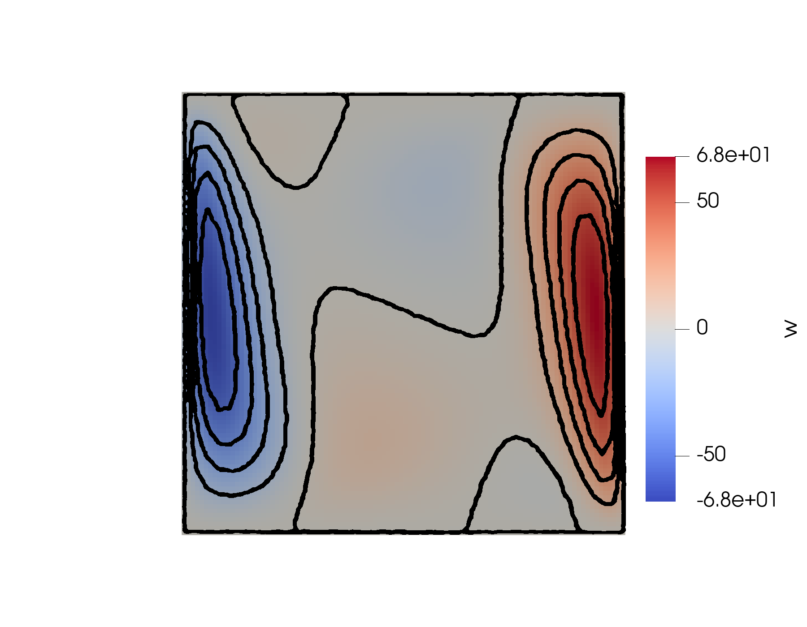
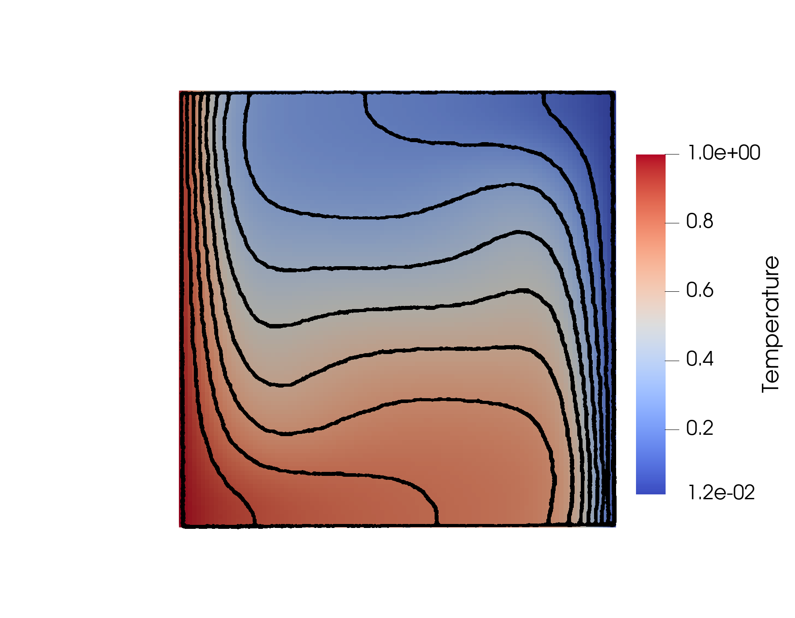

title: Boussinesq flow in 2D cavity

# Boussinesq flow in 2D cavity # {#eg_boussinesq_2d}

The differentially heated cavity is a canonical benchmark problem for validating solvers with buoyancy-driven flows under the Boussinesq approximation. 
It consists of a square cavity where the vertical walls are held at different temperatures, inducing natural convection currents due to density variations. 

The governing equations in nondimensional form are:

**Continuity Equation** (Incompressibility): 

$$
\frac{\partial \tilde{u}}{\partial \tilde{x}} + \frac{\partial \tilde{w}}{\partial \tilde{z}} = 0 
$$

**Momentum equations:**

$$
\frac{\partial \tilde{u}}{\partial \tilde{t}} + \tilde{u}\frac{\partial \tilde{u}}{\partial \tilde{x}} + \tilde{w}\frac{\partial \tilde{u}}{\partial \tilde{z}}
= -\frac{\partial \tilde{p}}{\partial \tilde{x}} 
+ Pr \left( \frac{\partial^2 \tilde{u}}{\partial \tilde{x}^2} + \frac{\partial^2 \tilde{u}}{\partial \tilde{z}^2} \right)
$$

$$
\frac{\partial \tilde{w}}{\partial \tilde{t}} + \tilde{u}\frac{\partial \tilde{w}}{\partial \tilde{x}} + \tilde{w}\frac{\partial \tilde{w}}{\partial \tilde{z}}
= -\frac{\partial \tilde{p}}{\partial \tilde{z}} 
+ Pr \left( \frac{\partial^2 \tilde{w}}{\partial \tilde{x}^2} + \frac{\partial^2 \tilde{w}}{\partial \tilde{z}^2} \right) 
+ Ra \, Pr \, \tilde{T}
$$

**Temperature equation:**

$$
\frac{\partial \tilde{T}}{\partial \tilde{t}} + \tilde{u}\frac{\partial \tilde{T}}{\partial \tilde{x}} + \tilde{w}\frac{\partial \tilde{T}}{\partial \tilde{z}}
= \nabla^2 \tilde{T}
$$

Here, $Ra$ is the Rayleigh number, defined as
$
Ra = \frac{g \, \beta \, \Delta T \, L^3}{\nu \alpha},
$
and $Pr$ is the Prandtl number,
$
Pr = \frac{\nu}{\alpha},
$
where $g$ is the gravitational acceleration, $\beta$ is the thermal expansion coefficient, 
$\Delta T$ is the imposed temperature difference, $L$ is the characteristic length, 
$\nu$ is the kinematic viscosity, and $\alpha$ is the thermal diffusivity. 
These nondimensional numbers characterize the relative importance of buoyancy, viscous, 
and thermal diffusion effects.

**Boundary conditions:**

$$
\begin{split}
\mathbf{u}(x,z) &= 0 \quad \text{on all cavity walls}, \\
T(0,z) &= 1, \quad T(L,z) = 0, \quad 
\frac{\partial T}{\partial z}\big|_{z=0,L} = 0.
\end{split}
$$

The computational domain is a unit square cavity.

The left wall is heated to nondimensional temperature $T=1$, the right wall is cooled to $T=0$, 
and the horizontal walls are thermally insulated. 

Qualitative comparison of velocity and temperature fields at $Ra = 10^5$. 
Black contour lines correspond to the reference solution of de Vahl Davis' paper, overlaid onto the present simulation results.

**Horizontal velocity component u**:

**Vertical velocity component w**:

**Temperature field T**:

Comparison of simulation and benchmark results for Boussinesq cavity flow at different Rayleigh numbers: (a) flow quantities.

| Ra       | ψ (sim / bench) | ψ Err [%] | u_max (sim / bench) | u Err [%] | w_max (sim / bench) | w Err [%] |
|----------|------------------|-----------|----------------------|-----------|----------------------|-----------|
| 10^3     | 1.162 / 1.174    | -1.02     | 3.609 / 3.649        | -1.10     | 3.658 / 3.697        | -1.05     |
| 10^4     | 5.028 / 5.071    | -0.85     | 16.029 / 16.178      | -0.92     | 19.418 / 19.617      | -1.01     |
| 10^5     | 9.071 / 9.111    | -0.44     | 34.679 / 34.730      | -0.15     | 68.091 / 68.590      | -0.73     |
| 10^6     | 16.313 / 16.320  | -0.04     | 65.471 / 64.630      | +1.30     | 218.446 / 219.360    | -0.42     |

(b) thermal and position quantities.

| Ra       | Nu (sim / bench) | Nu Err [%] | u_z (sim / bench) | w_x (sim / bench) |
|----------|-------------------|-------------|-------------------|-------------------|
| 10^3     | 1.108 / 1.118     | -0.89       | 0.815 / 0.813     | 0.175 / 0.178     |
| 10^4     | 2.219 / 2.243     | -1.07       | 0.175 / 0.823     | 0.115 / 0.119     |
| 10^5     | 4.458 / 4.519     | -1.35       | 0.855 / 0.855     | 0.065 / 0.066     |
| 10^6     | 8.610 / 8.800     | -2.16       | 0.855 / 0.850     | 0.035 / 0.038     |

## Reference:
- G. de Vahl Davis, Natural convection of air in a square cavity: A benchmark numerical solution, International Journal for Numerical Methods in Fluids 3 (3) (1983) 249–264.

